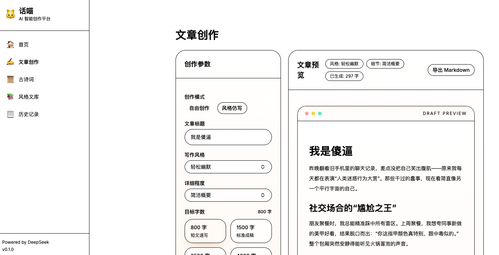
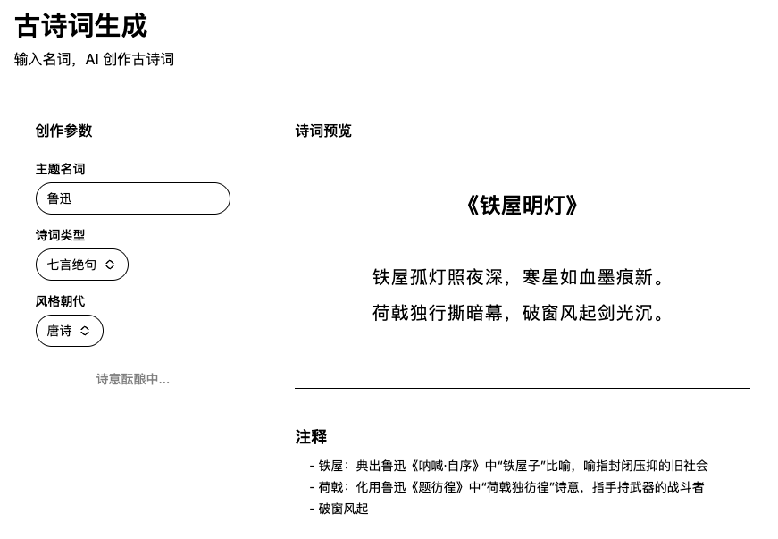
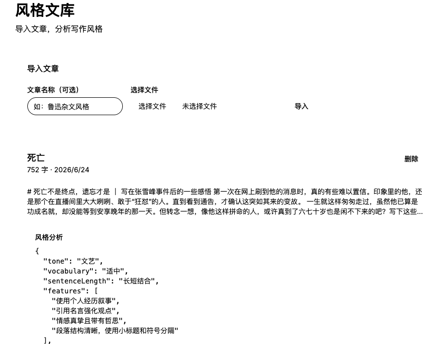
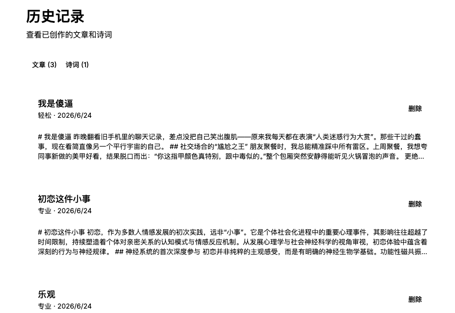

# 【零基础AI应用开发】Next.js + DeepSeek 从零搭建 AI 创作平台|完整教程

> 别被"AI应用开发"吓到，看完这篇你会发现：对于有开发基础的人来说，无非就是多学一个 API 用法而已。

> 本教程手把手带你从零搭建一个完整的 AI 智能创作平台，从环境搭建到部署上线，每一步都能跑通验证。跟着做完，你就能在简历上写"有 AI 应用开发经验"了。

## 为什么要写这个教程？

最近面试被问"有没有 AI 项目经验"的前端越来越多了。

说实话，AI 应用开发没有想象中那么难。你不需要懂算法、不需要会训练模型、不需要学 Python。你需要的是：

- 会调 API 
- 会写 Prompt
- 会做流式渲染
- 会搭页面

## 最终效果预览

本教程为了快速产出实际效果，样式没有过多修饰，大家可以根据自己的需要进行二次开发。









## 功能清单

| 功能 | 说明 | 涉及技术 |
|------|------|---------|
| **文章创作器** | 输入标题，AI 生成格式化文章，支持选择字数、风格、详细程度 | Vercel AI SDK, streamText |
| **古诗词生成** | 输入一个名词，AI 创作古诗词，附带注释和赏析 | Prompt Engineering, Few-shot |
| **风格文库** | 导入你喜欢的文章，AI 分析写作风格 | 结构化输出, generateObject |
| **风格仿写** | 参考导入文章的风格进行创作 | RAG, Embedding, 向量检索 |
| **历史记录** | 所有创作内容持久化保存 | SQLite, Drizzle ORM |
| **部署上线** | 公网可访问 | Vercel, Turso |

## 技术栈

```
框架：    Next.js 15 (App Router) + TypeScript
UI：      Tailwind CSS + shadcn/ui
AI层：    Vercel AI SDK（流式输出）+ LangChain.js（RAG）
LLM：    DeepSeek（国产大模型，中文能力强，价格便宜）
数据库：  SQLite + Drizzle ORM
部署：    Vercel
```

**为什么选 DeepSeek？** 中文写作效果好，价格是 GPT-4o 的 1/18，学习阶段充 10 块钱够用很久。API 完全兼容 OpenAI 格式，换模型只需改两行代码。

## 教程目录（14 章 + 附录）

| 章节 | 你将学到 | 关键词 |
|------|---------|--------|
| [第01章](./第01章-环境搭建与工具安装.md) | 安装 Node.js、pnpm，注册 DeepSeek API Key | 环境变量、包管理器 |
| [第02章](./第02章-项目初始化与Nextjs基础.md) | 创建 Next.js 项目，理解 App Router | 文件路由、服务端组件 |
| [第03章](./第03章-UI搭建与组件库.md) | Tailwind + shadcn/ui 搭建整体布局 | 原子化 CSS、组件库 |
| [第04章](./第04章-AI基础调用LLM-API.md) | 第一次调用 AI API，理解 Token 和 Temperature | OpenAI SDK、API Route |
| [第05章](./第05章-流式响应与打字机效果.md) | 流式输出，打字机效果 | SSE、streamText、useCompletion |
| [第06章](./第06章-Prompt-Engineering实战.md) | Prompt 设计技巧 | Few-shot、Chain-of-Thought |
| [第07章](./第07章-文章创作器核心功能.md) | 文章创作器完整实现 | 表单、Markdown 渲染 |
| [第08章](./第08章-古诗词生成器.md) | 古诗词生成器 | 领域 Prompt、古风 UI |
| [第09章](./第09章-数据库与数据持久化.md) | SQLite + Drizzle ORM 数据持久化 | ORM、数据库迁移 |
| [第10章](./第10章-风格文库与文档导入.md) | 文件上传、AI 风格分析 | 结构化输出、Zod |
| [第11章](./第11章-RAG与风格仿写.md) | RAG 检索增强生成 | Embedding、向量搜索 |
| [第12章](./第12章-体验优化与进阶功能.md) | 收藏、导出、暗色模式 | UX 优化、主题切换 |
| [第13章](./第13章-部署上线.md) | 部署到 Vercel | 环境变量、Turso |
| [第14章](./第14章-总结与扩展方向.md) | 回顾总结与未来方向 | 扩展思路 |
| [附录](./附录-常见问题与排错.md) | 常见报错与解决方案 | FAQ |

## 适合谁？

- 有前端基础（React/Vue）的开发者，想了解 AI 应用开发
- 面试被问"有没有 AI 项目经验"，想有东西可讲
- 想做一个能写进简历的 AI 全栈项目
- 对 Agent、RAG、Prompt Engineering 感兴趣但不知从何入手

## 学习建议

```
1. 按章节顺序学习，每章都有前置依赖
2. 每章结束后动手验证，确认效果再继续
3. 不理解的概念先跳过，实践中会慢慢理解
4. 遇到问题先看附录的常见问题
5. 预计总学习时间：40-60 小时
```

## 学完你能得到什么？

- 一个部署在公网的 AI 创作平台（可以写进简历）
- 对 LLM API、Prompt Engineering、RAG 的实战理解
- 一份完整的 AI 全栈项目经验
- 继续深入 Agent 开发的基础能力

---

> 如果这个教程对你有帮助，欢迎 Star 和分享。有问题可以在 Issues 中提出。
