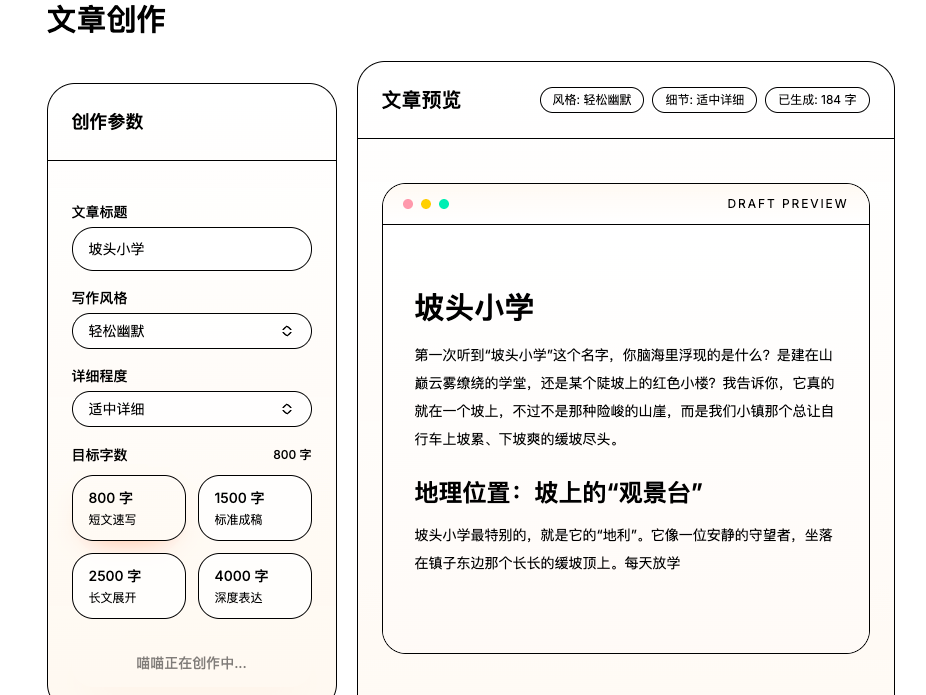

# 【零基础AI应用开发】第07章：文章创作器 — 核心功能（创作篇）

> 📦 项目教程仓库：https://github.com/ZIQI-a/AI_Agent_study
> 🚀 成品项目地址：https://github.com/ZIQI-a/huamiao_Agent

## 本章目标

**要做的事**：构建完整的文章创作功能 —— 表单输入、AI 生成、Markdown 渲染

**学到的知识**：
- 表单状态管理
- Prompt 模板化
- Markdown 实时渲染
- 字数统计

## 7.1 安装依赖

```bash
# Markdown 渲染
pnpm add react-markdown remark-gfm rehype-highlight

# 代码高亮样式
pnpm add highlight.js
```

## 7.2 创建 Prompt 模板

创建 `src/lib/prompts/article.ts`：

```typescript
export interface ArticleOptions {
  title: string;
  style: string;
  wordCount: number;
  detailLevel: string;
}

export function getArticleSystemPrompt(options: ArticleOptions) {
  const { style, wordCount, detailLevel } = options;

  return `你是一位经验丰富的写作专家，擅长各类文体创作。

## 写作要求
- 文章字数：约${wordCount}字
- 写作风格：${style}
- 详细程度：${detailLevel}
- 使用 Markdown 格式输出
- 必须有清晰的标题和段落结构

## 文章结构
1. 标题（# 标题）
2. 引言（简要概述文章主题，吸引读者注意）
3. 正文（分为3-5个要点，每个要点用 ## 小标题）
4. 总结（总结全文要点，给出思考或建议）

## 写作约束
- 不要使用"首先、其次、最后"这种老套的连接词
- 不要在开头说"在这个快节奏的时代"或类似套话
- 每个要点必须有具体的例子或数据支撑
- 语言要自然流畅，像真人写的

## 风格参考
${getStyleGuide(style)}`;
}

function getStyleGuide(style: string): string {
  const guides: Record<string, string> = {
    专业: "用词准确严谨，逻辑清晰。适合技术文档、行业分析。",
    轻松: "口语化表达，适当幽默，像朋友聊天。适合生活类文章。",
    文艺: "语言优美，意境丰富，善用修辞。适合散文、随笔。",
    新闻: "客观中立，重要信息放前面。适合新闻报道。",
    故事: "以叙事为主，有人物、情节、冲突。适合案例分析。",
  };
  return guides[style] || guides["专业"];
}

export const ARTICLE_STYLES = [
  { value: "专业", label: "专业严谨" },
  { value: "轻松", label: "轻松幽默" },
  { value: "文艺", label: "文艺优美" },
  { value: "新闻", label: "新闻报道" },
  { value: "故事", label: "故事叙事" },
];

export const DETAIL_LEVELS = [
  { value: "简洁", label: "简洁概要" },
  { value: "适中", label: "适中详细" },
  { value: "详尽", label: "详尽深入" },
];
```

## 7.3 创建 API Route

创建 `src/app/api/articles/generate/route.ts`：

```typescript
import { streamText } from "ai";
import { createOpenAI } from "@ai-sdk/openai";
import { getArticleSystemPrompt } from "@/lib/prompts/article";

const deepseek = createOpenAI({
  apiKey: process.env.DEEPSEEK_API_KEY,
  baseURL: "https://api.deepseek.com",
});

export async function POST(req: Request) {
  const { title, style, wordCount, detailLevel } = await req.json();

  if (!title) {
    return new Response("标题不能为空", { status: 400 });
  }

  const system = getArticleSystemPrompt({
    title,
    style: style || "专业",
    wordCount: wordCount || 1500,
    detailLevel: detailLevel || "适中",
  });

  const result = streamText({
    model: deepseek("deepseek-chat"),
    system,
    prompt: `请以《${title}》为题，创作一篇文章。`,
    maxTokens: 4000,
    temperature: 0.8,
  });

  return result.toDataStreamResponse();
}
```

## 7.4 创建 Markdown 渲染组件

创建 `src/components/ui/markdown-renderer.tsx`：

```typescript
"use client";

import ReactMarkdown from "react-markdown";
import remarkGfm from "remark-gfm";
import "highlight.js/styles/github.css";

interface MarkdownRendererProps {
  content: string;
}

export function MarkdownRenderer({ content }: MarkdownRendererProps) {
  return (
    <ReactMarkdown
      remarkPlugins={[remarkGfm]}
      className="prose prose-slate max-w-none dark:prose-invert"
      components={{
        // 自定义标题样式
        h1: ({ children }) => (
          <h1 className="text-3xl font-bold mt-8 mb-4 text-primary">
            {children}
          </h1>
        ),
        h2: ({ children }) => (
          <h2 className="text-2xl font-semibold mt-6 mb-3 text-primary/90">
            {children}
          </h2>
        ),
        h3: ({ children }) => (
          <h3 className="text-xl font-medium mt-4 mb-2">{children}</h3>
        ),
        // 自定义段落
        p: ({ children }) => (
          <p className="leading-7 mb-4 text-foreground/90">{children}</p>
        ),
        // 自定义引用
        blockquote: ({ children }) => (
          <blockquote className="border-l-4 border-primary/30 pl-4 italic text-muted-foreground my-4">
            {children}
          </blockquote>
        ),
        // 自定义代码块
        code: ({ className, children, ...props }) => {
          const isInline = !className;
          if (isInline) {
            return (
              <code
                className="bg-muted px-1.5 py-0.5 rounded text-sm font-mono"
                {...props}
              >
                {children}
              </code>
            );
          }
          return (
            <pre className="bg-muted rounded-lg p-4 overflow-x-auto my-4">
              <code className={className} {...props}>
                {children}
              </code>
            </pre>
          );
        },
        // 自定义列表
        ul: ({ children }) => (
          <ul className="list-disc list-inside space-y-1 my-4">{children}</ul>
        ),
        ol: ({ children }) => (
          <ol className="list-decimal list-inside space-y-1 my-4">{children}</ol>
        ),
        // 自定义分割线
        hr: () => <hr className="my-8 border-border" />,
      }}
    />
  );
}
```

## 7.5 构建创作页面

安装额外的 UI 组件：

```bash
pnpm dlx shadcn@latest add label slider
```

修改 `src/app/articles/create/page.tsx`：

```typescript
"use client";

import { useState } from "react";
import { useCompletion } from "ai/react";
import { Button } from "@/components/ui/button";
import { Input } from "@/components/ui/input";
import { Label } from "@/components/ui/label";
import {
  Card,
  CardContent,
  CardHeader,
  CardTitle,
} from "@/components/ui/card";
import {
  Select,
  SelectContent,
  SelectItem,
  SelectTrigger,
  SelectValue,
} from "@/components/ui/select";
import { PageContainer } from "@/components/layout/page-container";
import { MarkdownRenderer } from "@/components/ui/markdown-renderer";
import {
  ARTICLE_STYLES,
  DETAIL_LEVELS,
} from "@/lib/prompts/article";

export default function CreateArticle() {
  const [title, setTitle] = useState("");
  const [style, setStyle] = useState("专业");
  const [wordCount, setWordCount] = useState("1500");
  const [detailLevel, setDetailLevel] = useState("适中");

  const { completion, isLoading, error, complete } = useCompletion({
    api: "/api/articles/generate",
  });

  const handleGenerate = async () => {
    if (!title.trim()) return;

    await complete("", {
      body: { title, style, wordCount: Number(wordCount), detailLevel },
    });
  };

  // 粗略统计字数
  const charCount = completion?.length || 0;

  return (
    <PageContainer
      title="文章创作"
      description="输入标题，选择参数，AI 帮你写文章"
    >
      <div className="grid grid-cols-1 lg:grid-cols-3 gap-6">
        {/* 左侧：参数面板 */}
        <div className="lg:col-span-1 space-y-6">
          <Card>
            <CardHeader>
              <CardTitle>创作参数</CardTitle>
            </CardHeader>
            <CardContent className="space-y-4">
              {/* 标题 */}
              <div className="space-y-2">
                <Label htmlFor="title">文章标题</Label>
                <Input
                  id="title"
                  value={title}
                  onChange={(e) => setTitle(e.target.value)}
                  placeholder="输入文章标题..."
                />
              </div>

              {/* 风格 */}
              <div className="space-y-2">
                <Label>写作风格</Label>
                <Select value={style} onValueChange={setStyle}>
                  <SelectTrigger>
                    <SelectValue />
                  </SelectTrigger>
                  <SelectContent>
                    {ARTICLE_STYLES.map((s) => (
                      <SelectItem key={s.value} value={s.value}>
                        {s.label}
                      </SelectItem>
                    ))}
                  </SelectContent>
                </Select>
              </div>

              {/* 字数 */}
              <div className="space-y-2">
                <Label>目标字数</Label>
                <Select value={wordCount} onValueChange={setWordCount}>
                  <SelectTrigger>
                    <SelectValue />
                  </SelectTrigger>
                  <SelectContent>
                    <SelectItem value="800">800 字（短文）</SelectItem>
                    <SelectItem value="1500">1500 字（标准）</SelectItem>
                    <SelectItem value="2500">2500 字（长文）</SelectItem>
                    <SelectItem value="4000">4000 字（深度）</SelectItem>
                  </SelectContent>
                </Select>
              </div>

              {/* 详细程度 */}
              <div className="space-y-2">
                <Label>详细程度</Label>
                <Select value={detailLevel} onValueChange={setDetailLevel}>
                  <SelectTrigger>
                    <SelectValue />
                  </SelectTrigger>
                  <SelectContent>
                    {DETAIL_LEVELS.map((d) => (
                      <SelectItem key={d.value} value={d.value}>
                        {d.label}
                      </SelectItem>
                    ))}
                  </SelectContent>
                </Select>
              </div>

              {/* 生成按钮 */}
              <Button
                onClick={handleGenerate}
                disabled={!title.trim() || isLoading}
                className="w-full"
                size="lg"
              >
                {isLoading ? "AI 创作中..." : "开始创作"}
              </Button>
            </CardContent>
          </Card>
        </div>

        {/* 右侧：预览区 */}
        <div className="lg:col-span-2">
          <Card className="min-h-[600px]">
            <CardHeader className="flex flex-row items-center justify-between">
              <CardTitle>文章预览</CardTitle>
              {completion && (
                <span className="text-sm text-muted-foreground">
                  {charCount} 字
                </span>
              )}
            </CardHeader>
            <CardContent>
              {error && (
                <div className="text-red-500 mb-4">
                  生成失败：{error.message}
                </div>
              )}

              {!completion && !isLoading && (
                <div className="text-center text-muted-foreground py-20">
                  <div className="text-5xl mb-4">✍️</div>
                  <p>输入标题，选择参数，开始创作</p>
                </div>
              )}

              {isLoading && !completion && (
                <div className="text-center text-muted-foreground py-20">
                  <div className="text-5xl mb-4 animate-bounce">🐱</div>
                  <p>话喵正在思考...</p>
                </div>
              )}

              {completion && (
                <div className="relative">
                  <MarkdownRenderer content={completion} />
                  {isLoading && (
                    <span className="inline-block w-0.5 h-5 bg-primary animate-pulse" />
                  )}
                </div>
              )}
            </CardContent>
          </Card>
        </div>
      </div>
    </PageContainer>
  );
}
```

## 7.6 添加全局 Markdown 样式

在 `src/app/globals.css` 中添加：

```css
/* Markdown 渲染样式 */
.prose h1 {
  @apply text-3xl font-bold mt-8 mb-4;
}

.prose h2 {
  @apply text-2xl font-semibold mt-6 mb-3;
}

.prose h3 {
  @apply text-xl font-medium mt-4 mb-2;
}

.prose p {
  @apply leading-7 mb-4;
}

.prose blockquote {
  @apply border-l-4 border-primary/30 pl-4 italic my-4;
}

.prose code {
  @apply bg-muted px-1.5 py-0.5 rounded text-sm;
}

.prose pre {
  @apply bg-muted rounded-lg p-4 overflow-x-auto my-4;
}

.prose pre code {
  @apply bg-transparent p-0;
}

.prose ul {
  @apply list-disc list-inside space-y-1 my-4;
}

.prose ol {
  @apply list-decimal list-inside space-y-1 my-4;
}

.prose hr {
  @apply my-8 border-border;
}

.prose a {
  @apply text-primary underline;
}

.prose strong {
  @apply font-semibold;
}

.prose table {
  @apply w-full border-collapse my-4;
}

.prose th,
.prose td {
  @apply border border-border px-4 py-2;
}

.prose th {
  @apply bg-muted font-medium;
}
```

## 7.7 测试文章创作

启动项目，访问 `http://localhost:3000/articles/create`：

1. 输入标题：「为什么前端开发者应该学 AI」
2. 选择风格：专业严谨
3. 选择字数：1500 字
4. 点击「开始创作」
5. 观察文章逐字生成，Markdown 实时渲染



## 本章小结

| 概念 | 说明 |
|------|------|
| Prompt 模板化 | 把 Prompt 抽成函数，参数控制行为 |
| useCompletion | Vercel AI SDK 的流式补全 Hook |
| react-markdown | React 的 Markdown 渲染组件 |
| remark-gfm | 支持 GitHub 风格 Markdown（表格、任务列表等） |
| 字数统计 | `completion.length` 粗略统计 |

## 动手验证

1. 输入不同标题，测试 AI 生成质量
2. 切换不同风格，观察文风差异
3. 选择不同字数，看是否接近目标
4. 检查 Markdown 渲染是否正确（标题、列表、引用等）

## 下一章预告

文章创作器完成了，下一个功能是古诗词生成器。我们将设计专门的诗词 Prompt，实现输入一个名词就能创作古诗词，并附带注释和赏析。

---

> 如果这个教程对你有帮助，欢迎 ⭐ Star 支持一下！
> - 📦 教程仓库：https://github.com/ZIQI-a/AI_Agent_study
> - 🚀 成品项目：https://github.com/ZIQI-a/huamiao_Agent
