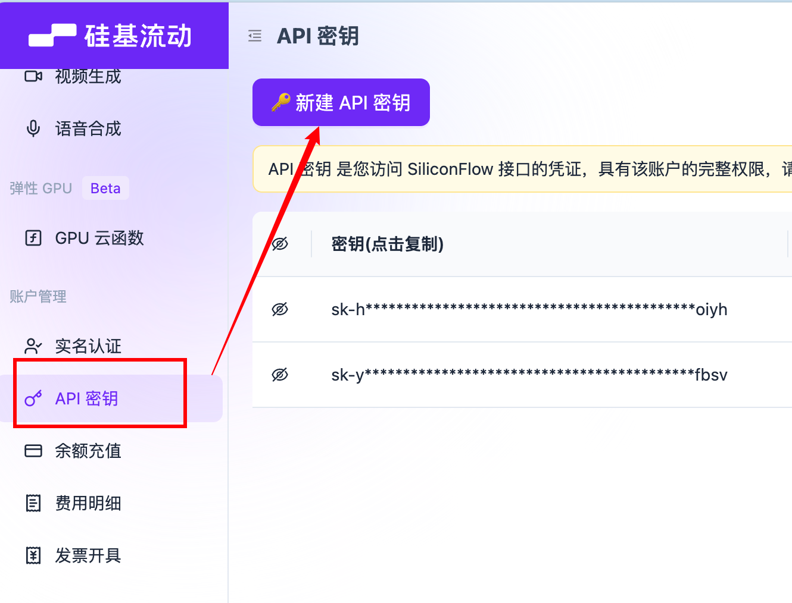

# 第11章：RAG 与风格仿写

> 📦 项目教程仓库：https://github.com/ZIQI-a/AI_Agent_study
> 🚀 成品项目地址：https://github.com/ZIQI-a/huamiao_Agent

## 本章目标

**要做的事**：用 RAG 技术实现风格仿写 —— 参考导入的文章风格进行创作

**学到的知识**：
- Embedding 是什么（文本变向量）
- 向量相似度搜索
- LangChain.js 的文档处理工具链
- RAG 的完整流程

## 11.1 什么是 Embedding？

```
Embedding = 把文本变成一串数字（向量）

"今天天气真好" → [0.23, -0.15, 0.87, ..., 0.42]  （1536个数字）
"今天天气不错" → [0.25, -0.13, 0.85, ..., 0.40]  （很接近！）
"股票跌了很多" → [-0.67, 0.34, -0.21, ..., 0.11] （差很远）

核心特性：
  语义相近的文字 → 向量距离近
  语义不同的文字 → 向量距离远

用途：
  搜索：不靠关键词匹配，靠语义相似度
  分类：相近的文本聚在一起
  推荐：相似的内容推荐给用户
```

前端类比：就像把文字变成坐标，相似的文字坐标靠近。

## 11.2 安装 LangChain.js

```bash
pnpm add langchain @langchain/core @langchain/openai
```

## 11.3 创建 Embedding 工具

创建 `src/lib/rag/embeddings.ts`：

```typescript
import { OpenAIEmbeddings } from "@langchain/openai";

// 创建 Embedding 模型
// DeepSeek 没有自己的 Embedding 模型，使用兼容 OpenAI 的服务
// 这里用 OpenAI 的，也可以换成其他兼容服务
export const embeddings = new OpenAIEmbeddings({
  model: "text-embedding-3-small",
  // 如果要切换到其他 Embedding 服务，修改 baseURL
  // openAIApiKey: process.env.OPENAI_API_KEY,
});
```

**注意：**

这里如果调用的模型不支持embeddings的话需要其他方法，使用其他模型供应商的大模型来调用
我这里用的是硅基流动；

1、去 [siliconflow.cn](https://cloud.siliconflow.cn/i/Wnh0xp4S) 注册，填邀请码 `Wnh0xp4S` 送 ¥14 额度;

2、注册后直接在API秘钥这里新建API秘钥， 然后复制秘钥备用；


3、拿到 API Key 后，改一下配置就行：

```typescript
export const embeddings = new OpenAIEmbeddings({
    model: "BAAI/bge-large-zh-v1.5", 
    apiKey: process.env.SILICONFLOW_API_KEY,
    configuration: {
        baseURL: "https://api.siliconflow.cn/v1",
    },
});
```

可以跟我选一样的模型，或者选择其他嵌入模型都可以，注意在 `.env` 添加相关的apiKey;

> **知识点：Embedding 模型 vs LLM**
> ```
> LLM：输入文本 → 输出文本（生成）
> Embedding：输入文本 → 输出向量（表示）
> 
> LLM 用来"写"，Embedding 用来"搜"
> 它们是 AI 应用的两个不同能力
> ```

## 11.4 向量存储与检索

创建 `src/lib/rag/vectorstore.ts`：

```typescript
import { MemoryVectorStore } from "langchain/vectorstores/memory";
import { RecursiveCharacterTextSplitter } from "langchain/text_splitter";
import { embeddings } from "./embeddings";
import { db } from "@/lib/db";
import { styles } from "@/lib/db/schema";
import { eq } from "drizzle-orm";

// 全局向量存储（内存中）
let vectorStore: MemoryVectorStore | null = null;

// 文档分块
export async function splitText(content: string) {
  const splitter = new RecursiveCharacterTextSplitter({
    chunkSize: 500,       // 每块500字符
    chunkOverlap: 50,     // 块之间重叠50字符
    separators: ["\n\n", "\n", "。", "！", "？", ".", " "],
  });

  return splitter.createDocuments([content]);
}

// 初始化向量存储（从数据库加载所有风格文章）
export async function initVectorStore() {
  const allStyles = await db.select().from(styles);

  if (allStyles.length === 0) {
    vectorStore = null;
    return;
  }

  // 把所有文章分块
  const allDocs = [];
  for (const style of allStyles) {
    const docs = await splitText(style.content);
    // 给每个文档块加上来源信息
    docs.forEach((doc) => {
      doc.metadata.styleId = style.id;
      doc.metadata.styleName = style.name;
    });
    allDocs.push(...docs);
  }

  // 创建向量存储
  vectorStore = await MemoryVectorStore.fromDocuments(allDocs, embeddings);
}

// 检索相似文档
export async function searchSimilar(query: string, k: number = 3) {
  if (!vectorStore) {
    await initVectorStore();
  }

  if (!vectorStore) {
    return [];
  }

  const results = await vectorStore.similaritySearchWithScore(query, k);

  return results.map(([doc, score]) => ({
    content: doc.pageContent,
    styleId: doc.metadata.styleId,
    styleName: doc.metadata.styleName,
    score: score.toFixed(3),
  }));
}
```

> **知识点：MemoryVectorStore**
> - 数据存在内存中，重启后丢失
> - 每次启动从数据库重新加载
> - 适合本地开发和中小数据量
> - 生产环境可以换成 Pinecone、Chroma 等持久化向量数据库

## 11.5 创建风格仿写 API

创建 `src/app/api/articles/imitate/route.ts`：

```typescript
import { streamText } from "ai";
import { createOpenAI } from "@ai-sdk/openai";
import { searchSimilar } from "@/lib/rag/vectorstore";
import { saveArticle } from "@/lib/db/operations";

const deepseek = createOpenAI({
  apiKey: process.env.DEEPSEEK_API_KEY,
  baseURL: "https://api.deepseek.com",
});

export async function POST(req: Request) {
  const { title, styleId, wordCount } = await req.json();

  if (!title) {
    return new Response("标题不能为空", { status: 400 });
  }

  // 检索参考文章片段
  const similarDocs = await searchSimilar(title, 3);

  // 构建参考上下文
  const referenceContext =
    similarDocs.length > 0
      ? `\n\n## 参考风格\n以下是风格参考文章的片段，请模仿其写作风格：\n\n${similarDocs
          .map((doc, i) => `### 参考${i + 1}（来自：${doc.styleName}）\n${doc.content}`)
          .join("\n\n")}`
      : "";

  const system = `你是一位经验丰富的写作专家，擅长模仿各种写作风格。

## 写作要求
- 文章字数：约${wordCount || 1500}字
- 使用 Markdown 格式输出
- 必须有清晰的标题和段落结构
${referenceContext}

## 写作原则
1. 模仿参考文章的语言风格、用词习惯、句式结构
2. 保持内容的原创性，不要照搬参考文章的内容
3. 文章要围绕标题展开，有实质内容
4. 如果没有参考风格，就用自然流畅的写作风格`;

  const result = streamText({
    model: deepseek("deepseek-chat"),
    system,
    prompt: `请以《${title}》为题，创作一篇文章。`,
    maxTokens: 4000,
    temperature: 0.8,
    onFinish: async ({ text }) => {
      await saveArticle({
        title,
        content: text,
        style: similarDocs.length > 0 ? "风格仿写" : "默认",
        wordCount: text.length,
        detailLevel: "适中",
      });
    },
  });

  return result.toDataStreamResponse();
}
```

## 11.6 更新文章创作页面

在文章创作页面添加「风格仿写」选项：

修改 `src/app/articles/create/page.tsx`，添加仿写模式：

```typescript
// 在参数面板中添加风格选择
import { useState, useEffect } from "react";

// ... 在组件内部添加：
const [stylesList, setStylesList] = useState<any[]>([]);
const [selectedStyleId, setSelectedStyleId] = useState<string>("");
const [mode, setMode] = useState<"normal" | "imitate">("normal");

useEffect(() => {
  fetch("/api/styles")
    .then((res) => res.json())
    .then(setStylesList);
}, []);

// 修改生成按钮逻辑：
const handleGenerate = async () => {
  if (!title.trim()) return;

  if (mode === "imitate" && selectedStyleId) {
    // 风格仿写模式
    await complete("", {
      body: { title, styleId: Number(selectedStyleId), wordCount: Number(wordCount) },
    });
  } else {
    // 普通模式
    await complete("", {
      body: { title, style, wordCount: Number(wordCount), detailLevel },
    });
  }
};
```

在参数面板中添加模式切换：

```typescript
{/* 创作模式 */}
<div className="space-y-2">
  <Label>创作模式</Label>
  <div className="flex gap-2">
    <Button
      variant={mode === "normal" ? "default" : "outline"}
      size="sm"
      onClick={() => setMode("normal")}
    >
      自由创作
    </Button>
    <Button
      variant={mode === "imitate" ? "default" : "outline"}
      size="sm"
      onClick={() => setMode("imitate")}
    >
      风格仿写
    </Button>
  </div>
</div>

{/* 风格选择（仿写模式显示） */}
{mode === "imitate" && (
  <div className="space-y-2">
    <Label>选择参考风格</Label>
    <Select value={selectedStyleId} onValueChange={setSelectedStyleId}>
      <SelectTrigger>
        <SelectValue placeholder="选择风格文库中的文章" />
      </SelectTrigger>
      <SelectContent>
        {stylesList.map((s: any) => (
          <SelectItem key={s.id} value={String(s.id)}>
            {s.name}
          </SelectItem>
        ))}
      </SelectContent>
    </Select>
    {stylesList.length === 0 && (
      <p className="text-xs text-muted-foreground">
        请先在风格文库中导入文章
      </p>
    )}
  </div>
)}
```

## 11.7 测试 RAG 风格仿写

1. 先在风格文库中导入 2-3 篇风格鲜明的文章
2. 点击「分析风格」，让 AI 分析每篇文章
3. 回到文章创作页面，切换到「风格仿写」模式
4. 选择一个参考风格，输入标题，生成文章
5. 对比自由创作和风格仿写的差异

## 11.8 RAG 流程总结

```
导入阶段：
  文章内容 → 分块(Chunking) → Embedding → 向量存储

检索阶段：
  用户输入标题 → Embedding → 向量搜索 → 找到相似片段 → 拼接到 Prompt

生成阶段：
  System Prompt + 参考片段 + 用户标题 → LLM → 风格仿写的文章
```

## 本章小结

| 概念 | 说明 |
|------|------|
| Embedding | 文本变向量，用于语义相似度搜索 |
| 向量存储 | 存储 Embedding 向量，支持相似度检索 |
| 文档分块 | 把长文档切成小块，便于检索 |
| RAG | 检索增强生成，先搜再写 |
| LangChain.js | AI 工具链框架，提供文档处理、向量存储等能力 |

## 动手验证

1. 导入风格文库，确认分析成功
2. 风格仿写模式下生成文章，观察是否模仿了参考风格
3. 对比不同参考风格的仿写效果
4. 查看 API 日志，理解 RAG 的检索过程

## 下一章预告

核心功能都完成了！下一章我们做体验优化 —— 收藏功能、导出为 Markdown/PDF、多模型切换、暗色模式等。

---

> 如果这个教程对你有帮助，欢迎 ⭐ Star 支持一下！
> - 📦 教程仓库：https://github.com/ZIQI-a/AI_Agent_study
> - 🚀 成品项目：https://github.com/ZIQI-a/huamiao_Agent
